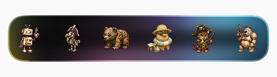

# Codpet - Interactive Pixel Companions / 像素桌面伴侣

[English](#english) | [简体中文](#简体中文)

## Built with OpenAI

CodPet was developed using OpenAI Codex and GPT-5.6.

Codex was used for:
- Building the companion management prototype
- Developing automation workflows
- Debugging compatibility issues
- Iterating product features

GPT-5.6 was used for:
- Product architecture exploration
- Technical problem solving
- Documentation and project storytelling
---

<a name="english"></a>
## English Description

**Codpet** (formerly Codex Pets) is a personal, curated collection of animated companions designed to live in your editor or developer environment. It is maintained as a personal project and does not accept third-party pet submissions.

This repository serves as:
- **Asset Storage**: Every pet is neatly organized in its own folder containing its runtime metadata (`pet.json`) and spritesheet (`spritesheet.webp`).
- **Interactive Showcase**: A high-performance, minimalist static web gallery deployed at [https://cod.pet/](https://cod.pet/).

### Live Preview & Showcase

Browse the library online at: **[https://cod.pet/](https://cod.pet/)**
- **Hover to Preview**: Move your mouse over any pet to see its accelerated interactive animations.
- **One-click Download**: Click `Download` on hover to grab a packaged `.zip` containing the pet's complete assets for easy installation.

### Native macOS App

**CodpetPersonal** is an experimental native macOS companion for browsing installed pets, importing local pet folders, installing pets, and applying a selected pet to Codex.

- Source and build instructions: [`apps/macos-pet-manager/`](apps/macos-pet-manager/)
- Product roadmap: [`docs/roadmap.md`](docs/roadmap.md)
- Architecture notes: [`docs/architecture.md`](docs/architecture.md)
- Asset policy: [`docs/asset-policy.md`](docs/asset-policy.md)
- This is a personal project and is not an official OpenAI product.



[Watch the CodpetPersonal demo video](apps/macos-pet-manager/screenshots/codpetpersonal-demo.mp4)

### Repository Structure

```text
pets/
  <pet-folder>/
    pet.json          # Pet state mapping and metadata
    spritesheet.webp  # Spritesheet image
    base.png          # Static base thumbnail for documentation
index.json            # Generated catalog data in JSON
catalog.js            # Browser-ready catalog payload
index.html            # Ultra-minimalist showcase page
assets/
  brand/              # Logo, favicon, and social preview assets
  icons/              # Website interface icons
apps/
  macos-pet-manager/  # Native macOS CodpetPersonal prototype
  macos-hybrid-app/   # Experimental hybrid macOS prototype
docs/                 # Product roadmap and project notes
scripts/
  build_index.py      # Script to rebuild catalog index
  generate_thumbnails.py # Script to generate base thumbnails
  generate_favicon.py # Script to generate the browser tab icon
```

### Updating the Catalog
When you add, remove, or rename pets, rebuild the index using:
```bash
python3 scripts/build_index.py
```

### Generating Base Thumbnails
To update documentation thumbnails for all pets from their spritesheets:
```bash
python3 scripts/generate_thumbnails.py
```

### Generating Favicon
To update the high-definition favicon.png browser tab icon from the Blackbird assets:
```bash
python3 scripts/generate_favicon.py
```

---

<a name="简体中文"></a>
## 简体中文说明

**Codpet**（原名 Codex Pets）是一个由我个人持续整理的开发者宠物作品库，面向编辑器和开发环境。项目不接受第三方 pet 提交。

本仓库主要用途：
- **资源存储**：每只宠物拥有独立目录，包含其运行时元数据 (`pet.json`) 及精灵图 (`spritesheet.webp`)。
- **互动展示页**：部署于 [https://cod.pet/](https://cod.pet/) 的极简、高性能展示画廊。

### 原生 macOS App

**CodpetPersonal** 是一个实验性的原生 macOS pet 管理器，用于浏览已安装 pet、导入本地 pet、安装 pet，以及尝试将选中的 pet 应用到 Codex。

- 源码与构建说明：[`apps/macos-pet-manager/`](apps/macos-pet-manager/)
- 产品路线图：[`docs/roadmap.md`](docs/roadmap.md)
- 项目架构说明：[`docs/architecture.md`](docs/architecture.md)
- 素材政策：[`docs/asset-policy.md`](docs/asset-policy.md)
- 这是个人项目，不是 OpenAI 官方产品。


[观看 CodpetPersonal 录屏演示](apps/macos-pet-manager/screenshots/codpetpersonal-demo.mp4)

### 线上互动预览

在线浏览地址：**[https://cod.pet/](https://cod.pet/)**
- **悬停预览**：将鼠标悬停在任意宠物上，即可加速循环预览其所有状态的动态效果。
- **一键下载**：悬浮时点击 `Download` 即可一键下载包含该宠物完整元数据与精灵图的 `.zip` 压缩包。

### 目录结构

```text
pets/
  <宠物目录>/
    pet.json          # 宠物元数据及动作状态映射
    spritesheet.webp  # 精灵图
    base.png          # 用于文档的静态基础缩略图
index.json            # 自动生成的整站 JSON 索引
catalog.js            # 浏览器直接加载的 JS 索引
index.html            # 超极简的线上画廊单页面
assets/
  brand/               # Logo、favicon 和社交预览资源
  icons/               # 网站界面图标
apps/
  macos-pet-manager/   # 原生 macOS CodpetPersonal 原型
  macos-hybrid-app/    # 实验性混合 macOS 原型
docs/                  # 产品路线图和项目说明
scripts/
  build_index.py      # 重建整站索引的 Python 脚本
  generate_thumbnails.py # 从精灵图自动裁剪生成静态缩略图的脚本
  generate_favicon.py # 自动裁剪、居中缩放生成浏览器图标的脚本
```

### 更新索引
当您添加、删除或重命名宠物时，运行以下命令重建索引：
```bash
python3 scripts/build_index.py
```

### 生成基础缩略图
需要更新宠物在 README 文档中的静态缩略图时，运行：
```bash
python3 scripts/generate_thumbnails.py
```

### 生成浏览器图标
需要从黑鸟资源更新高清浏览器页签图标时，运行：
```bash
python3 scripts/generate_favicon.py
```

---

## Pets Gallery / 宠物画廊

Here is a visual list of all the **117** interactive pixel pets available in Codpet:

<table align="center">
  <tr>
    <td align="center" valign="middle" width="160" height="160"></td>
    <td align="center" valign="middle" width="160" height="160"></td>
    <td align="center" valign="middle" width="160" height="160"></td>
    <td align="center" valign="middle" width="160" height="160"></td>
    <td align="center" valign="middle" width="160" height="160"></td>
    <td align="center" valign="middle" width="160" height="160"></td>
  </tr>
  <tr>
    <td align="center" valign="middle" width="160" height="160"></td>
    <td align="center" valign="middle" width="160" height="160"></td>
    <td align="center" valign="middle" width="160" height="160"></td>
    <td align="center" valign="middle" width="160" height="160"></td>
    <td align="center" valign="middle" width="160" height="160"></td>
    <td align="center" valign="middle" width="160" height="160"></td>
  </tr>
  <tr>
    <td align="center" valign="middle" width="160" height="160"></td>
    <td align="center" valign="middle" width="160" height="160"></td>
    <td align="center" valign="middle" width="160" height="160"></td>
    <td align="center" valign="middle" width="160" height="160"></td>
    <td align="center" valign="middle" width="160" height="160"></td>
    <td align="center" valign="middle" width="160" height="160"></td>
  </tr>
  <tr>
    <td align="center" valign="middle" width="160" height="160"></td>
    <td align="center" valign="middle" width="160" height="160"></td>
    <td align="center" valign="middle" width="160" height="160"></td>
    <td align="center" valign="middle" width="160" height="160"></td>
    <td align="center" valign="middle" width="160" height="160"></td>
    <td align="center" valign="middle" width="160" height="160"></td>
  </tr>
  <tr>
    <td align="center" valign="middle" width="160" height="160"></td>
    <td align="center" valign="middle" width="160" height="160"></td>
    <td align="center" valign="middle" width="160" height="160"></td>
    <td align="center" valign="middle" width="160" height="160"></td>
    <td align="center" valign="middle" width="160" height="160"></td>
    <td align="center" valign="middle" width="160" height="160"></td>
  </tr>
  <tr>
    <td align="center" valign="middle" width="160" height="160"></td>
    <td align="center" valign="middle" width="160" height="160"></td>
    <td align="center" valign="middle" width="160" height="160"></td>
    <td align="center" valign="middle" width="160" height="160"></td>
    <td align="center" valign="middle" width="160" height="160"></td>
    <td align="center" valign="middle" width="160" height="160"></td>
  </tr>
  <tr>
    <td align="center" valign="middle" width="160" height="160"></td>
    <td align="center" valign="middle" width="160" height="160"></td>
    <td align="center" valign="middle" width="160" height="160"></td>
    <td align="center" valign="middle" width="160" height="160"></td>
    <td align="center" valign="middle" width="160" height="160"></td>
    <td align="center" valign="middle" width="160" height="160"></td>
  </tr>
  <tr>
    <td align="center" valign="middle" width="160" height="160"></td>
    <td align="center" valign="middle" width="160" height="160"></td>
    <td align="center" valign="middle" width="160" height="160"></td>
    <td align="center" valign="middle" width="160" height="160"></td>
    <td align="center" valign="middle" width="160" height="160"></td>
    <td align="center" valign="middle" width="160" height="160"></td>
  </tr>
  <tr>
    <td align="center" valign="middle" width="160" height="160"></td>
    <td align="center" valign="middle" width="160" height="160"></td>
    <td align="center" valign="middle" width="160" height="160"></td>
    <td align="center" valign="middle" width="160" height="160"></td>
    <td align="center" valign="middle" width="160" height="160"></td>
    <td align="center" valign="middle" width="160" height="160"></td>
  </tr>
  <tr>
    <td align="center" valign="middle" width="160" height="160"></td>
    <td align="center" valign="middle" width="160" height="160"></td>
    <td align="center" valign="middle" width="160" height="160"></td>
    <td align="center" valign="middle" width="160" height="160"></td>
    <td align="center" valign="middle" width="160" height="160"></td>
    <td align="center" valign="middle" width="160" height="160"></td>
  </tr>
  <tr>
    <td align="center" valign="middle" width="160" height="160"></td>
    <td align="center" valign="middle" width="160" height="160"></td>
    <td align="center" valign="middle" width="160" height="160"></td>
    <td align="center" valign="middle" width="160" height="160"></td>
    <td align="center" valign="middle" width="160" height="160"></td>
    <td align="center" valign="middle" width="160" height="160"></td>
  </tr>
  <tr>
    <td align="center" valign="middle" width="160" height="160"></td>
    <td align="center" valign="middle" width="160" height="160"></td>
    <td align="center" valign="middle" width="160" height="160"></td>
    <td align="center" valign="middle" width="160" height="160"></td>
    <td align="center" valign="middle" width="160" height="160"></td>
    <td align="center" valign="middle" width="160" height="160"></td>
  </tr>
  <tr>
    <td align="center" valign="middle" width="160" height="160"></td>
    <td align="center" valign="middle" width="160" height="160"></td>
    <td align="center" valign="middle" width="160" height="160"></td>
    <td align="center" valign="middle" width="160" height="160"></td>
    <td align="center" valign="middle" width="160" height="160"></td>
    <td align="center" valign="middle" width="160" height="160"></td>
  </tr>
  <tr>
    <td align="center" valign="middle" width="160" height="160"></td>
    <td align="center" valign="middle" width="160" height="160"></td>
    <td align="center" valign="middle" width="160" height="160"></td>
    <td align="center" valign="middle" width="160" height="160"></td>
    <td align="center" valign="middle" width="160" height="160"></td>
    <td align="center" valign="middle" width="160" height="160"></td>
  </tr>
  <tr>
    <td align="center" valign="middle" width="160" height="160"></td>
    <td align="center" valign="middle" width="160" height="160"></td>
    <td align="center" valign="middle" width="160" height="160"></td>
    <td align="center" valign="middle" width="160" height="160"></td>
    <td align="center" valign="middle" width="160" height="160"></td>
    <td align="center" valign="middle" width="160" height="160"></td>
  </tr>
  <tr>
    <td align="center" valign="middle" width="160" height="160"></td>
    <td align="center" valign="middle" width="160" height="160"></td>
    <td align="center" valign="middle" width="160" height="160"></td>
    <td align="center" valign="middle" width="160" height="160"></td>
    <td align="center" valign="middle" width="160" height="160"></td>
    <td align="center" valign="middle" width="160" height="160"></td>
  </tr>
  <tr>
    <td align="center" valign="middle" width="160" height="160"></td>
    <td align="center" valign="middle" width="160" height="160"></td>
    <td align="center" valign="middle" width="160" height="160"></td>
    <td align="center" valign="middle" width="160" height="160"></td>
    <td align="center" valign="middle" width="160" height="160"></td>
    <td align="center" valign="middle" width="160" height="160"></td>
  </tr>
  <tr>
    <td align="center" valign="middle" width="160" height="160"></td>
    <td align="center" valign="middle" width="160" height="160"></td>
    <td align="center" valign="middle" width="160" height="160"></td>
    <td align="center" valign="middle" width="160" height="160"></td>
    <td align="center" valign="middle" width="160" height="160"></td>
    <td align="center" valign="middle" width="160" height="160"></td>
  </tr>
  <tr>
    <td align="center" valign="middle" width="160" height="160"></td>
    <td align="center" valign="middle" width="160" height="160"></td>
    <td align="center" valign="middle" width="160" height="160"></td>
    <td align="center" valign="middle" width="160" height="160"></td>
    <td align="center" valign="middle" width="160" height="160"></td>
    <td align="center" valign="middle" width="160" height="160"></td>
  </tr>
  <tr>
    <td align="center" valign="middle" width="160" height="160"></td>
    <td align="center" valign="middle" width="160" height="160"></td>
    <td align="center" valign="middle" width="160" height="160"></td>
    <td align="center" valign="middle" width="160" height="160">&nbsp;</td>
    <td align="center" valign="middle" width="160" height="160">&nbsp;</td>
    <td align="center" valign="middle" width="160" height="160">&nbsp;</td>
  </tr>
</table>
